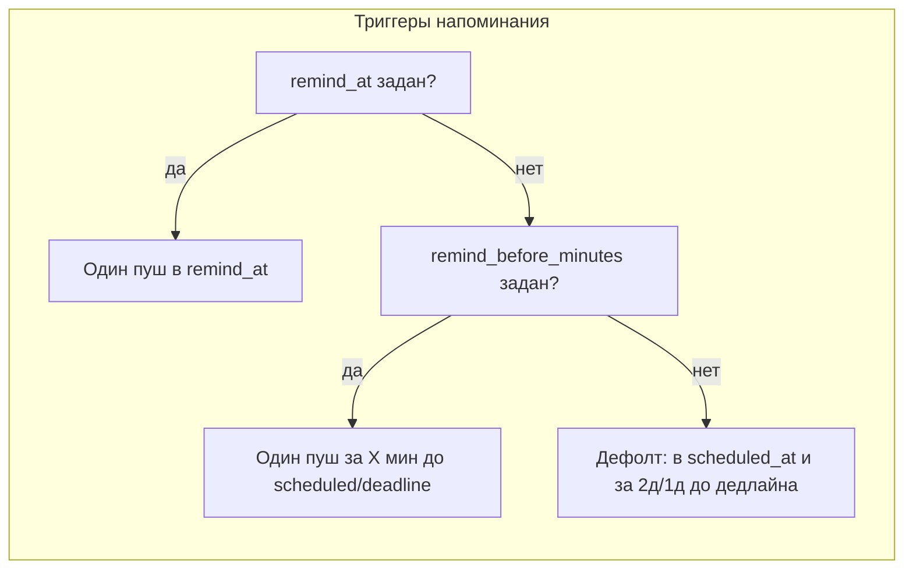

# Настройка «когда» и «за сколько» напоминать по задачам

## Текущее состояние

- **Бэкенд** ([userTaskReminder.service.js](workflow-service/src/main/services/userTaskReminder.service.js)): жёсткие правила — пуш в момент `remind_at` (если задан), иначе в момент `scheduled_at`, иначе за 2 и за 1 день до дедлайна. Пользователь не может выбрать «за 30 мин до» или «в 09:00».
- **Мобилка**: только переключатель «Включить напоминания»; нет выбора времени или смещения.

## Целевое поведение

- **Точное время**: уже есть поле `remind_at` (дата+время). Оставляем как есть и даём в UI возможность задать дату/время напоминания.
- **За сколько до**: новое поле `remind_before_minutes` (целое, минуты). Один пуш в момент `(reference - remind_before_minutes)`. Опорная точка: `scheduled_at`, если есть, иначе дедлайн (`deadline_to` + `deadline_time`). Если задано `remind_at`, оно по-прежнему имеет приоритет (как сейчас).

---

## 1. Бэкенд (workflow-service)

### 1.1 Миграция

- Файл: новая миграция в [src/main/migrations/](workflow-service/src/main/migrations/) (например `061-user-tasks-remind-before-minutes.sql`).
- Добавить в таблицу `user_tasks` колонку:
  - `remind_before_minutes` INTEGER NULL (минуты до опорного времени; NULL = использовать текущую логику по умолчанию).

### 1.2 Модель

- В [userTask.model.js](workflow-service/src/main/models/userTask.model.js): добавить поле `remind_before_minutes: DataTypes.INTEGER, allowNull: true`.

### 1.3 Сервис задач

- В [userTask.service.js](workflow-service/src/main/services/userTask.service.js):
  - В `create`: принимать `body.remind_before_minutes` (число или null), записывать в задачу.
  - В `update`: при переданном `body.remind_before_minutes` обновлять поле (допускать 0 и положительные значения; null = сброс).
  - В `applyReminderAction` при действии `off` при желании можно также обнулять `remind_before_minutes` (для консистентности).

### 1.4 Сервис напоминаний

- В [userTaskReminder.service.js](workflow-service/src/main/services/userTaskReminder.service.js):
  - В выборку кандидатов добавить задачи, у которых задано `remind_before_minutes` и опорное время (scheduled_at или deadline) попадает в окно «сейчас ± 2 мин» после вычитания смещения.
  - В блоке формирования `triggers`:
    - Если есть `remind_at` — как сейчас, один триггер по `remind_at`.
    - Иначе если задано `remind_before_minutes`:
      - Опорное время: `scheduled_at` если есть, иначе `new Date(deadline_to + 'T' + deadline_time + ':00.000Z')` (если есть deadline_to и deadline_time).
      - Один триггер: опорное время минус `remind_before_minutes` (в миллисекундах).
    - Иначе — текущая логика по умолчанию (scheduled_at, -2d, -1d для дедлайна).
  - Убедиться, что в запрос попадают задачи с ненулевым `remind_before_minutes` (например, расширить условие `Op.or` или отдельно учитывать при обходе задач и вычислении триггеров в окне).

---

## 2. Мобильное приложение (workflow-mobile)

### 2.1 API и типы

- В [lib/user-tasks-api.ts](workflow-mobile/lib/user-tasks-api.ts):
  - В интерфейс `UserTask` добавить `remind_before_minutes: number | null`.
  - В `createUserTask` и `updateUserTask` в теле запроса допустить опциональное поле `remind_before_minutes` (number | null).

### 2.2 Константы вариантов «за сколько»

- Имеет смысл вынести варианты в константу, например:
  - `0` — в момент (время задачи/дедлайна),
  - `15`, `30`, `60` — за 15 мин, 30 мин, 1 ч,
  - `1440`, `2880` — за 1 день, 2 дня.
- Либо один общий список `{ value: number, label: string }[]` для селекта в формах.

### 2.3 Редактор задачи (task-editor)

- В [app/client/tasks/task-editor.tsx](workflow-mobile/app/client/tasks/task-editor.tsx):
  - Добавить состояние `remindBeforeMinutes: number | null` (и при загрузке задачи подставлять `task.remind_before_minutes`).
  - В блоке «Напоминания» под переключателем «Включить напоминания»:
    - Если напоминания включены — показать выбор: «Напомнить в момент времени» (опционально привязка к `remind_at` в будущем) или «Напомнить за … до» с выбором из предустановок (0 / 15 / 30 / 60 / 1440 / 2880 минут).
  - При сохранении (create/update) передавать выбранное значение в `remind_before_minutes`; при выборе «в момент» можно передавать `null` и при необходимости заполнять `remind_at` отдельно (если решите поддерживать точное время из формы).
  - Убедиться, что при создании задачи по умолчанию `remind_before_minutes` либо null, либо разумное значение (например 0 или null).

### 2.4 Экран деталей задачи (details)

- В [app/client/tasks/details.tsx](workflow-mobile/app/client/tasks/details.tsx):
  - В секции «Напоминания» кроме Switch показать текущее значение «за сколько» (если `remind_before_minutes != null`) и возможность изменить (селект с теми же вариантами 0/15/30/60/1440/2880 или «в момент» = null).
  - При изменении вызывать `updateTask` с `remind_before_minutes`.

### 2.5 Список задач (TodoTab) и отображение

- По желанию: в [components/tasks/TodoTab.tsx](workflow-mobile/components/tasks/TodoTab.tsx) под задачей с включёнными напоминаниями показывать короткую подпись вида «За 30 мин» или «В момент», если это не перегружает список (опционально).

---

## 3. Важные детали

- **Приоритет**: `remind_at` > `remind_before_minutes` > дефолтная логика (scheduled_at, -2d/-1d).
- **Опорное время для «за X до»**: только если есть `scheduled_at` или (deadline_to + deadline_time); иначе «за X до» не имеет смысла, можно не отправлять пуш или не показывать опцию в UI для такой задачи.
- **Дедупликация**: без изменений — один лог на (task_id, user_id, remind_at); момент времени для лога будет вычисленный (reference - remind_before_minutes).
- **Часовой пояс**: все времена на бэкенде в UTC; мобилка при отображении вариантов «за 15/30/60 мин / 1 день / 2 дня» может показывать только минуты/дни без привязки к таймзоне.

---

## 4. Чек-лист реализации

| Шаг | Где                                       | Действие                                                                             |
| --- | ----------------------------------------- | ------------------------------------------------------------------------------------ |
| 1   | workflow-service/migrations               | Создать миграцию, добавить `remind_before_minutes` в `user_tasks`                    |
| 2   | workflow-service/models                   | Добавить поле в модель UserTask                                                      |
| 3   | workflow-service/userTask.service         | create/update и опционально applyReminderAction обрабатывают `remind_before_minutes` |
| 4   | workflow-service/userTaskReminder.service | Добавить ветку триггеров по `remind_before_minutes` и расширить выборку кандидатов   |
| 5   | workflow-mobile/user-tasks-api            | Типы и вызовы API с `remind_before_minutes`                                          |
| 6   | workflow-mobile/task-editor               | UI: выбор «в момент» / «за X до» и сохранение в задаче                               |
| 7   | workflow-mobile/details                   | UI: отображение и смена «за сколько» в блоке напоминаний                             |

После этого в бэке и в мобилке будет явный функционал «когда именно» (remind_at) и «за сколько времени напоминать» (remind_before_minutes).